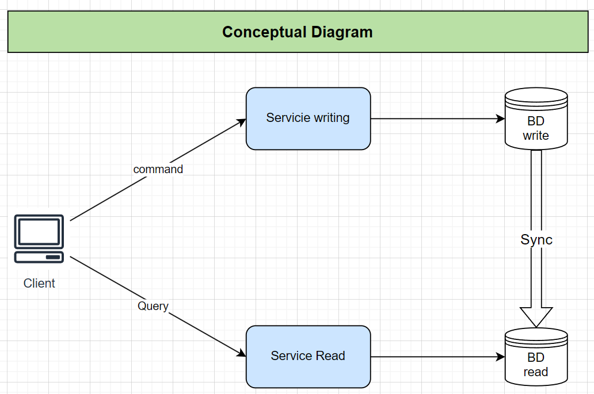
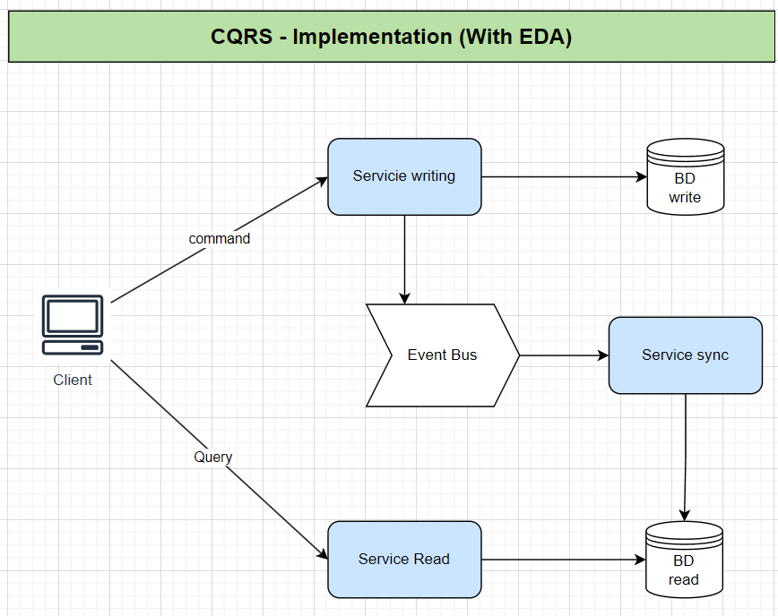
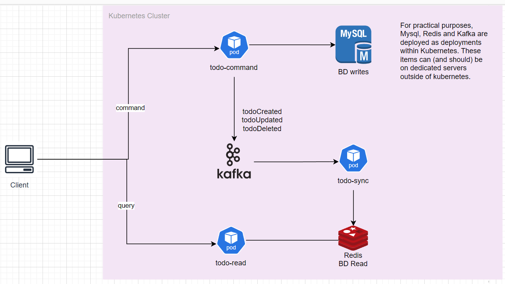
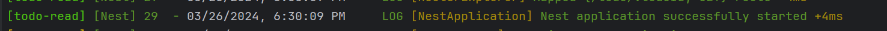
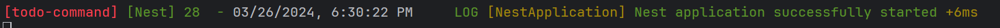
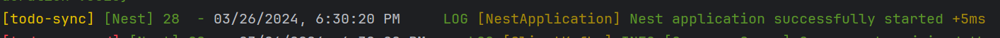
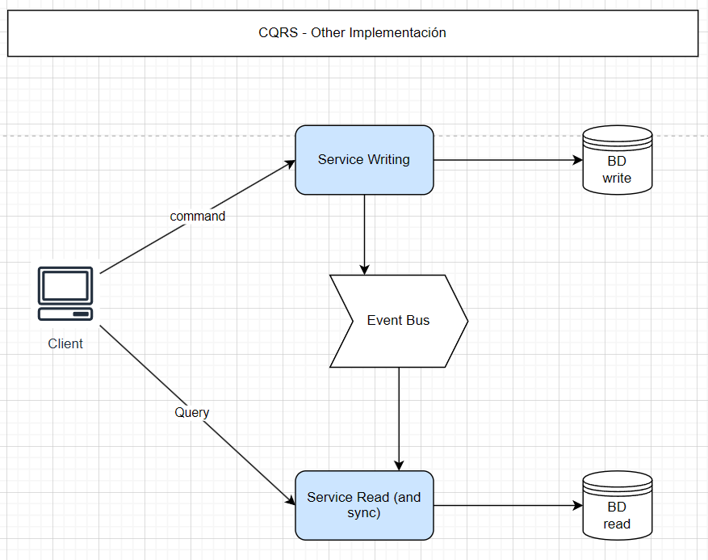
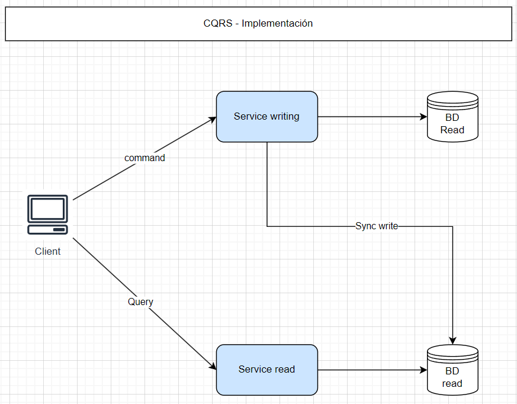
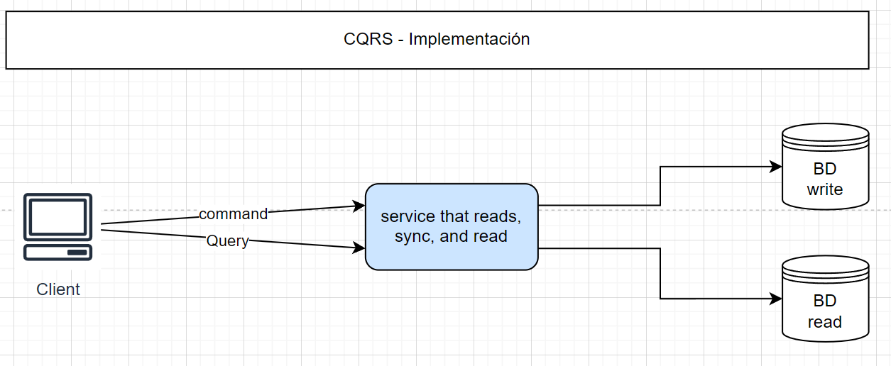

# CQRS : Sample with Nodejs, Kafka, Redis, Nestjs, Mysql, typeorm

### In this sample you view how:
    * Implement CQRS
    * Publish and subscribe to topic with Kafka with Nodejs
    * Implements Redis as cache with nodejs
    * Sample of deployments and services in kubernetes
    * Sample of Nestjs with kafka, redis, typeorm

## CQRS

It is a software architecture pattern that consists of separating read and write operations in 2 separate databases, so that they can scale autonomously or use different databases. Its purpose is to improve response times in writing and deed cases.




The writing database and the reading database must be synchronized by some mechanism,
One of the most common implementations includes the use of Event Driven Design, having as a diagram closest to
A real life implementation:



In this repository we are based on that diagram, so the real implementation of this example will be:


## How execute
You must have installed docker and skaffold.
- docker: https://docs.docker.com/engine/install/
- skaffold: https://skaffold.dev/docs/install/#standalone-binary

In this folder root execute
````shell
skaffold dev
````
Wait for 5 minutes or more. Wait for the service messages to be raised correctly (if you see errors, wait a few seconds for it to stabilize since the pods depend on the DBs and Kafka). If after several minutes you do not see success messages, cancel the console, then run 'skaffold delete' and run 'skaffold dev' again.
If you stand up correctly you should be able to see these messages:





- service todo-command listen on port 3000
- service todo-read listen on port 4000

attach postman collection: CQRS-nesjs.postman_collection.json

TODO: execute with docker-composer

## Others ways to implement CQRS (Not common, 'not recommended' but fully functional)

### Variant 1


### variant 2


### variant 3

